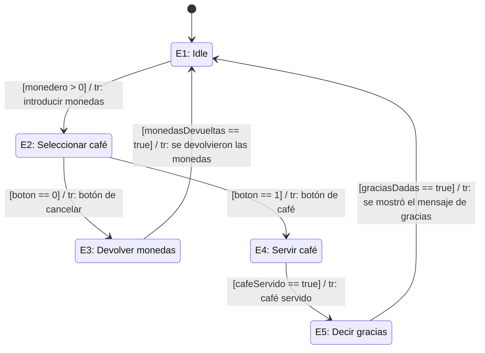

## Diagrama:

```mermaid
stateDiagram-v2
    [*] --> E1

    E1 : E1: Idle
    E2 : E2: Seleccionar café
    E3 : E3: Devolver monedas
    E4 : E4: Servir café
    E5 : E5: Decir gracias

    E1 --> E2 : [monedero > 0] / tr: introducir monedas
    E2 --> E3 : [boton == 0] / tr: botón de cancelar
    E2 --> E4 : [boton == 1] / tr: botón de café
    E3 --> E1 : [monedasDevueltas == true] / tr: se devolvieron las monedas
    E4 --> E5 : [cafeServido == true] / tr: café servido
    E5 --> E1 : [graciasDadas == true] / tr: se mostró el mensaje de gracias
```
