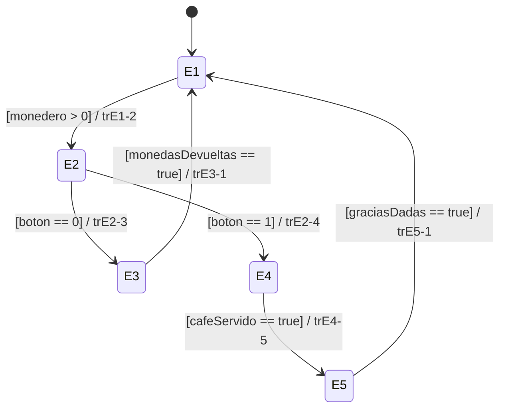

## Diagrama:

### Estados

- **E1 (Idle):** Estado inicial de reposo.
- **E2 (Seleccionar café):** Menú de selección de café o cancelación.
- **E3 (Devolver monedas):** Proceso de devolución de dinero.
- **E4 (Servir café):** Proceso de dispensación o preparación del café.
- **E5 (Decir gracias):** Estado para mostrar el mensaje de agradecimiento.

---

### Transiciones

- **trE1-2 (De E1 a E2):**
  - Condición: `monedero > 0`
  - Acción / Evento: Introducir monedas

- **trE2-3 (De E2 a E3):**
  - Condición: `boton == 0`
  - Acción / Evento: Botón de cancelar

- **trE2-4 (De E2 a E4):**
  - Condición: `boton == 1`
  - Acción / Evento: Botón de café

- **trE3-1 (De E3 a E1):**
  - Condición: `monedasDevueltas == true`
  - Acción / Evento: Se devolvieron las monedas

- **trE4-5 (De E4 a E5):**
  - Condición: `cafeServido == true`
  - Acción / Evento: Café servido

- **trE5-1 (De E5 a E1):**
  - Condición: `graciasDadas == true`
  - Acción / Evento: Se mostró el mensaje de gracias